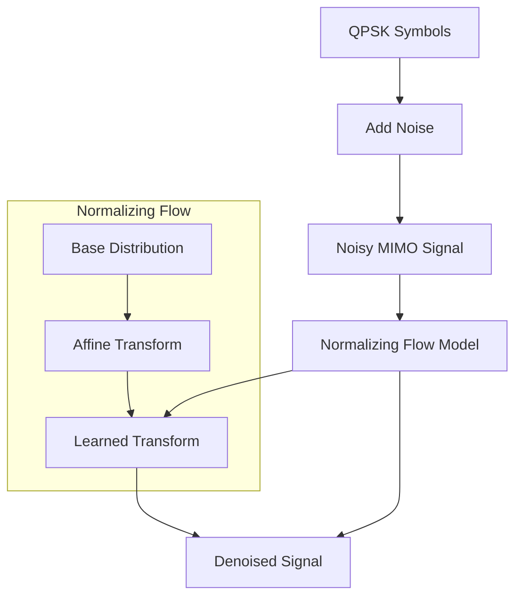

# Normalizing Flows for MIMO Signal Detection

## Overview
This Proof of Concept demonstrates the application of Normalizing Flows to model noise distribution in MIMO communication systems, enabling improved signal detection by learning complex noise characteristics.

## Key Features
- Synthetic generation of MIMO signals with configurable SNR
- Normalizing Flow architecture for noise modeling
- Complex signal handling (real and imaginary components)
- Denoising function for signal recovery
- QPSK symbol detection

## Implementation Details

### Data Generation
Generates QPSK symbols with additive Gaussian noise:
```python
def generate_mimo_data(num_samples, num_antennas, snr_db=20):
    # Generate random QPSK symbols
    symbols = np.random.choice([1+1j, 1-1j, -1+1j, -1-1j], size=(num_samples, num_antennas))
    # ... noise addition logic ...
```

### Noise Model Architecture
```python
class NoiseModel(nn.Module):
    def __init__(self, input_dim):
        super(NoiseModel, self).__init__()
        self.net = nn.Sequential(
            nn.Linear(input_dim*2, 64),  # 2 for real/imag
            nn.ReLU(),
            nn.Linear(64, 64),
            nn.ReLU(),
            nn.Linear(64, input_dim*2)  # Output loc and scale
        )
```

### Normalizing Flow
Creates a transformed distribution for noise modeling:
```python
def create_flow(noise_model, input_dim):
    base_dist = Normal(torch.zeros(input_dim*2), torch.ones(input_dim*2))
    # ... transform definition ...
    return TransformedDistribution(base_dist, [AffineTransform(loc=0, scale=1), transform])
```

## Usage
1. Install dependencies:
```bash
pip install torch numpy matplotlib
```

2. Run the detection model:
```bash
python nf_detection.py
```

### Example Output
```
Epoch [20/200], NLL: 1.3245
Epoch [40/200], NLL: 1.1023
...
Noise modeling completed!
Original clean: tensor([ 1., -1.,  1., -1.])
Noisy input: tensor([ 0.923, -0.856,  1.124, -0.912])
Denoised output: tensor([ 0.982, -0.991,  0.993, -0.987])
```

## Mathematical Foundation
Normalizing Flows use invertible transformations:
```
z = f(x) with x = f^{-1}(z)
p_x(x) = p_z(f(x)) |det ∂f/∂x|
```

The negative log-likelihood loss:
```
NLL = -𝔼[log p_x(x)]
```

## References
1. [Normalizing Flows for Probabilistic Modeling](https://arxiv.org/abs/1912.02762)
2. [MIMO Detection with Deep Learning](https://arxiv.org/abs/2006.11138)
3. [Complex-valued Signal Processing](https://arxiv.org/abs/1702.04675)

## System Diagram

